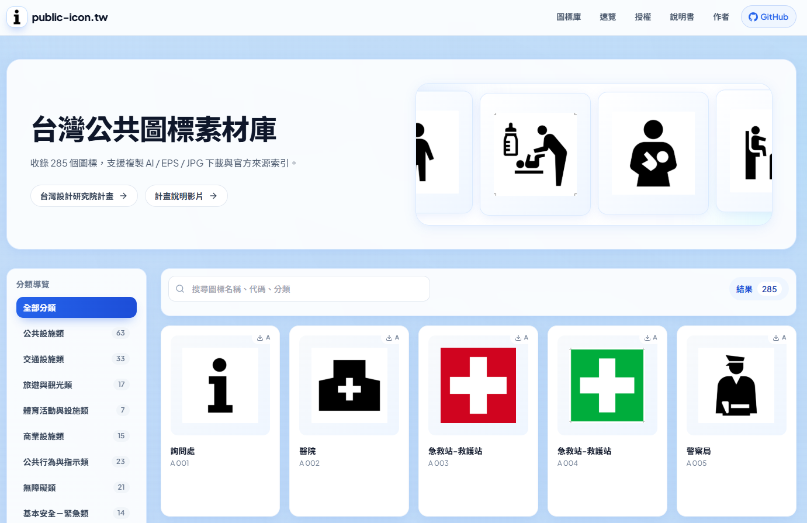
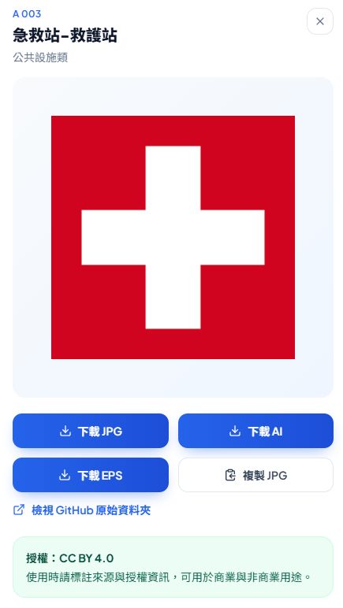
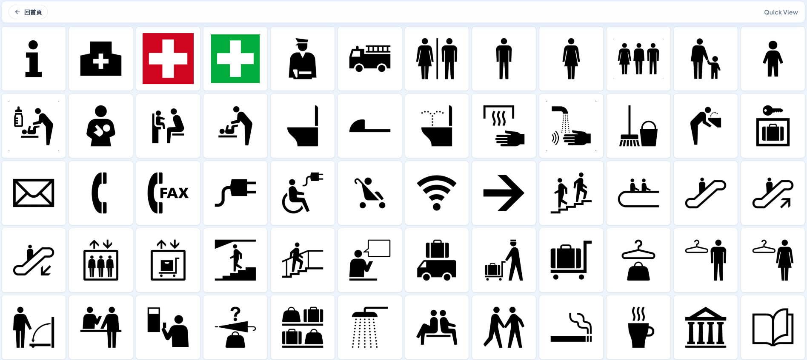

# 台灣公共圖標導覽與下載平台 public-icon.tw 

本專案將 CNS16282 相關圖標進行整理與前端化呈現，提供更好用的搜尋、分類瀏覽與格式下載。

## 線上連結
- Website: https://public-icon.tw/
- GitHub: https://github.com/su-nz/public-icon.tw

## 專案截圖

> 建議你把圖片放在 `docs/screenshots/`，然後把下方的圖片連結取消註解（或改成你的實際路徑）。

### 首頁

<!-- TODO: 插入首頁截圖 -->
<!--  -->

### 詳情抽屜（下載 / 原始資料夾連結）

<!-- TODO: 插入詳情抽屜截圖 -->
<!--  -->

### 純圖標速覽（/quick）

<!-- TODO: 插入 /quick 頁面截圖 -->
<!--  -->

## 快速開始

### 需求

- Node.js 18+
- npm

### 安裝與啟動

```bash
npm install
npm run dev
```

### 建置與預覽（靜態輸出）

> `npm run build` 會先執行 prebuild：掃描 `data/` 並產生清冊與靜態資產。

```bash
npm run build
npm run start
```

## 部署（Cloudflare Pages）

本專案為 Next.js 靜態輸出（`output: 'export'`），部署建議使用 Cloudflare Pages。

### Pages 設定

- Framework preset: Next.js
- Build command: `npm run build`
- Build output directory: `out`


## 授權與營利用途注意事項

官方參考連結：

- TDRI：https://www.tdri.org.tw/zh-TW/design-resource/CNS16282
- 官方影片：https://www.youtube.com/watch?v=nwHCwaP_AqQ
- CNS 檢索系統：https://www.cnsonline.com.tw

## 專案結構

```text
data/                   # 原始來源資料（ai / eps / jpg）
public/icons/            # prebuild 生成：展示用 JPG
public/downloads/         # prebuild 生成：AI / EPS 下載
scripts/prebuild.js       # 建置前掃描資料並產生清冊與輸出
src/lib/inventory.json    # prebuild 自動生成
src/app/                 # Next.js App Router 頁面
```


## License

- 圖標資料：CC BY 4.0
- 說明書：以官方公告與手冊版權頁條款為準
